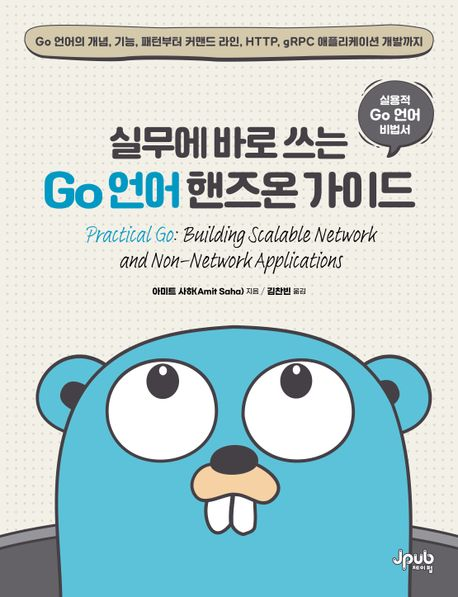

# 실무에 바로 쓰는 Go 언어 핸즈온 가이드

[실무에 바로 쓰는 Go 언어 핸즈온 가이드](https://product.kyobobook.co.kr/detail/S000200429794) - Go 언어의 개념, 기능, 패턴부터 커맨드 라인, HTTP, gRPC 애플리케이션 개발까지

### 스터디 개요
  Go 책을 함께 읽어나가며 Go 언어 전반을 이해하고, 실무에 적용하는 감각을 익혀보는 스터디를 하려 합니다. 교재는 실무에 바로 쓰는 Go 언어 핸즈온 가이드 입니다. 실무에서 만나게 되는 다양한 경우를 예제로 풀어내었는데 실제로 실무에 바로 도움이 되는 수준이면서도 지나치게 지엽적이거나 특수한 경우에 치우치지 않는 균형이 돋보이는 책입니다. 덧붙여 Go 언어를 넘어서서 프로그래밍 전반의 기반 지식을 차근히 일러줍니다.
  
### 목차
- [Ch.1] 커맨드 라인 애플리케이션 작성
- [Ch.2] 고급 커맨드 라인 애플리케이션
- [Ch.3] HTTP 클라이언트 작성
- [Ch.4] 고급 HTTP 클라이언트 - _@seoyoung 발표_
- [Ch.5] HTTP 서버 작성
- [Ch.6] 고급 HTTP 서버 애플리케이션
- [Ch.7] 실서비스 가능한 HTTP 서버
- [Ch.8] gRPC를 사용한 RPC 애플리케이션 
- [Ch.9] 고급 gRPC 애플리케이션
- [Ch.10] 실서비스 가능한 gRPC 애플리케이션
- [Ch.11] 데이터 저장소 활용
- [Appx.A] 애플리케이션을 관측 가능하게 만들기
- [Appx B] 애플리케이션 배포하기